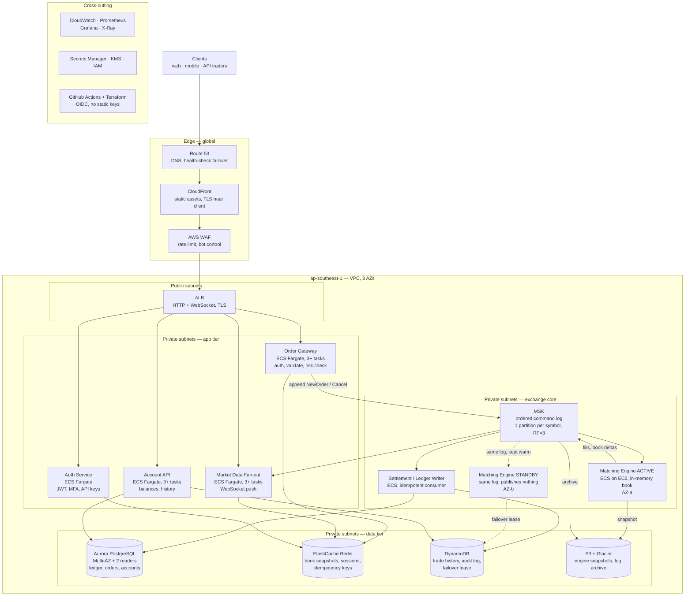

# Problem 1 — Building Castle In The Cloud

## The real problem

Task: a Binance-like trading system on AWS. 500 requests/second, p99 under 100ms.

These are two very different problems, so I say this clearly first.

**500 req/s is small.** One good Go or Java service on one `c7g.large` can handle it. If throughput was
the only problem, this design would be boring: one ALB, two containers, one Postgres.

**Being an exchange is the hard part.** The order book is one piece of state, and every order must be
applied in a fixed order. I cannot split one symbol's book between two writers. If two engines both
match BTC/USDT, they build two different books. Then the system pays real money for a trade that never
happened.

So the real question is not "how do I scale to 500 rps". It is "how do I make a single-writer component
highly available, without ever having two writers".

That is why I split the system in two:

| Part | What is in it | Property | Approach |
|---|---|---|---|
| **Exchange core** | Order entry, matching engine, ledger | Ordered, one writer only, correctness first | Event log + in-memory engine + hot standby |
| **Everything else** | Auth, market data, account reads, history | Stateless or read-only, availability first | Scale out, cache, multi-AZ |

**Features I cover:** spot orders and matching, market data over WebSocket, wallet balances with a
double-entry ledger, trade history.

**Out of scope:** futures, margin, staking, fiat deposit, KYC vendor, admin tools. Margin worries me
most, because a liquidation engine is also single-writer and low-latency. It needs the same design as
the matching engine.

## Things I do not know

| Unknown | I assumed | Why it matters |
|---|---|---|
| Read/write split | 90% reads → about 50 orders/sec | Sizes the engine and ledger writes |
| Average or peak 500 rps? | Peak, and I plan for a 10x burst | Autoscaling speed is what kills you in a spike |
| Where are the users? | Mostly APAC, `ap-southeast-1` | A second region changes the HA plan completely |
| How many symbols? | About 50 | Decides if one engine process is enough (it is) |
| Which regulator? | Not decided | Data residency, retention, can the ledger leave the region |
| p99 at the edge or at the ALB? | At the edge | Costs me 20-30ms before my code runs |

The question I would ask first: is 500 rps average or peak? All autoscaling depends on it.

---

## Diagram

## How an order flows

1. `POST /api/v3/order` → CloudFront → WAF → ALB → **Order Gateway**.
2. Gateway checks the API key, validates the body, and does the **risk check** against Redis, which also
   holds the idempotency key so a retry cannot double-submit.
3. Gateway appends `NewOrder` to the symbol's MSK partition and returns `202` with the order id.
   **The client's waiting time stops here.**
4. The **matching engine** reads that partition in order, applies the order to the in-memory book, and
   writes `Fill` / `BookDelta` / `Rejected` back to MSK.
5. **Settlement writer** turns fills into double-entry rows in Aurora, keyed by sequence number so
   replay is safe.
6. **Market data** reads the same events and pushes to WebSocket clients.
7. **Account API** serves balances and history.

**Why `202` and not the fill?** If the API waits, client latency becomes the sum of every step including
a Postgres commit, so one slow disk write becomes a client timeout. Binance does the same: their REST
order endpoint returns `NEW`. Cost is a more complex client. I accept that.

**Why MSK in the middle?** The log is how I recover. Every change is an ordered event, so I can rebuild
the exact book anywhere by replaying from the last snapshot. That is what makes the standby possible, and
the audit trail is free. HTTP straight to the engine is 5ms faster and leaves me no way to rebuild the
book after a crash.

---

## Why each service, and what else I considered

| Service | Role | Why this | Alternatives |
|---|---|---|---|
| **Route 53** | DNS, failover | Health checks work with ALB directly | Cloudflare DNS: another vendor, no gain at this size |
| **CloudFront** | Static files, TLS near client | TLS near the user saves real ms. Shield Standard free | Straight from ALB: one extra round trip for far users |
| **AWS WAF** | Rate limit per IP and API key | Bad traffic never reaches my compute | In the app: then I pay to reject traffic |
| **ALB** | L7 routing, WebSocket | Native WebSocket + ECS targets, multi-AZ | NLB: cheaper for many idle sockets, I would move market data there at ~20k connections. API Gateway: extra cost and one more hop |
| **ECS Fargate** | Gateway, market data, account, auth | No servers to patch, IAM role per task, scales in ~60s. Compute cost is small here, so operations time is my scarce resource | EKS: better with 3+ teams or autoscaling on Kafka lag, but weeks of work and permanent overhead. Lambda: I refuse it on the order path, cold starts break a p99 budget |
| **ECS on EC2** (engine only) | Engine active + standby | For the engine I want the host: pinned CPU, no noisy neighbour, warm in-memory book | Fargate: simpler and honestly fine at 50 orders/sec. I choose EC2 because when the engine misbehaves Fargate gives me no control |
| **Amazon MSK** | The ordered log, source of truth | Strict order per symbol, replay from an offset, many independent consumers. One partition per symbol | Kinesis: very close and cheaper, I almost chose it, loses on replay and consumer groups. SQS: no real ordering or replay. Self-managed Kafka: I do not want to fix broker rebalancing during an incident |
| **Engine active/standby** | Applies orders to the book | Only one writer allowed. Standby holds the same book but publishes nothing, and continues from the last committed offset | Active/active: impossible, two writers means two books. Book in the database (`SELECT … FOR UPDATE`): the tempting wrong answer, works at 50/sec then row locks are your limit |
| **Settlement writer** | Fills → ledger rows | Keeps a slow commit away from matching. Idempotent by sequence number | Ledger inside the engine: ties engine speed to Postgres |
| **Aurora PostgreSQL** | Ledger, orders, accounts | Money needs ACID and `NUMERIC`. 6 copies over 3 AZs, ~30s failover | RDS Multi-AZ: cheaper, 60-120s failover. DynamoDB: no real multi-row transactions, so no ledger. CockroachDB: good later, but a new database learned during incidents |
| **ElastiCache Redis** | Book snapshots, sessions, idempotency | Sub-ms reads keep REST inside the budget | Memcached: no pub/sub or data structures |
| **DynamoDB** | History, audit log, failover lease | Append-heavy, grows forever, nothing to operate | History in Aurora: becomes the table that dominates backups |
| **S3 + Glacier** | Snapshots, archive, retention | Cheap and durable | Nothing close |

Terraform for all infrastructure, applied from CI with OIDC, never from a laptop. Pipeline details in
[Problem 4](../problem4/SOLUTION.md).

---

## Meeting p99 < 100ms

Order placement, measured at the client, client in region:

| Step | Budget |
|---|---|
| Client → CloudFront (TLS reused) | 15 ms |
| CloudFront → ALB → task | 5 ms |
| Gateway: auth + validate + risk check | 8 ms |
| Gateway → MSK, `acks=all` | 10 ms |
| Response to client | 15 ms |
| **Total** | **~53 ms**, 47ms spare |

A cached read is about 37ms. A cache miss adds ~8ms from an Aurora reader.

What worries me, in order:

1. **`acks=all` across AZs.** If 10ms becomes 40ms under load my spare time is gone. Load test first,
   run RF=3 with `min.insync.replicas=2`.
2. **Fargate scales in ~60s.** A 10x spike in 10 seconds is served by tasks already running, so I keep
   utilisation at 50-60%, not 80%. Paying for idle capacity *is* the latency SLO.
3. **GC pauses**, if the engine is on the JVM. A 200ms stop-the-world pause is an outage here.
4. **Anything with no timeout.** [Problem 3](../problem3/SOLUTION.md) in this repo is exactly this bug.

The table is arithmetic, not proof. Before claiming the SLO: load test at 500 then 5,000 rps **from
outside AWS** with k6 (measuring inside the VPC hides a third of the budget), trace with X-Ray, and alert
on p99 as an SLO with a burn rate, not a fixed threshold.

Exchange alarms normal monitoring will not give you, which I treat as required:

- **engine consumer lag** — falling behind the log is the first sign of everything else
- **sequence gap** — can mean data loss, page immediately
- **crossed book** — best bid ≥ best ask means the engine is wrong. Halt that symbol
- **standby divergence** — different book hash means failover is not safe

Halting a symbol is embarrassing. A wrong book that keeps trading loses money every millisecond.

---

## High availability

| Failure | Effect | Recovery | Automatic? |
|---|---|---|---|
| One task dies | None, ALB drains it | ~60s | Yes |
| One AZ lost | 1/3 capacity, engine fails over | Standby continues from last offset | Yes, see note |
| Aurora writer fails | Writes pause | ~30s | Yes |
| Redis primary fails | Cache misses, slower | ~30s | Yes |
| One MSK broker fails | None (RF=3) | Replaced | Yes |
| Engine crashes | That symbol pauses | Standby, or snapshot + replay | Yes |
| Bad deploy | Depends | Blue/green with auto rollback | Yes |
| Region lost | Full outage | See below | **No, on purpose** |
| Bad code writes bad fills | Worst case | Replay log into a fixed build | No, needs a practised runbook |

Target **99.95% per month** (~22 min). I would agree this and the error budget with the business before
launch. "99.99%" in a document with no error budget is a wish.

**Engine failover note.** Automatic promotion is only safe if I can prove the old active is dead. Two
engines publishing fills is much worse than none, because the second is silently wrong and you find out
from customer complaints. So the standby must take a lease (DynamoDB conditional write with TTL) before it
publishes, and the active re-checks the lease before every publish. I prefer 30 seconds more downtime over
any chance of split brain.

**Why not multi-region active-active.** Cross-region replication is async, so RPO > 0. On a ledger that
means after failover, some trades exist in customer emails but not in the surviving ledger. You cannot fix
that automatically, and now you decide by hand who owns what. That is a regulator problem, not an
availability problem. Instead: (1) day one, one region and 3 AZs; (2) warm standby in a second region where
failover **starts by halting trading**, then reconciling, then reopening — RTO tens of minutes, RPO
effectively zero; (3) active-active for **reads only**, because market data 200ms stale is a UX issue, not
a correctness one. That third one is where multi-region actually pays, and I would do it first.

---

## Scaling plan

**500 → 5,000 rps: turn the dials.** Nothing structural changes.

- Raise task counts and autoscaling floors. Policies already exist.
- Add Aurora read replicas and send history and balance reads to the reader endpoint. If the app does not
  already use a separate reader connection string, that is the one code change I want before launch.
- Redis cluster mode, shard book snapshots by symbol.
- Move market data to its own NLB and task family. It scales with **connected clients**, not requests, so
  sharing one autoscaling policy with REST means one of them is always wrong.
- Right-size MSK brokers, enable tiered storage.

**5,000 → 50,000 rps: the real limits.** Three things break, in this order:

1. **Market data fan-out.** 50k clients wanting book updates is a bandwidth and CPU problem, not a request
   problem. Fix: dedicated fan-out fleet, send deltas not snapshots, throttled feed for retail plus a full
   feed for paying clients, edge tier for the public feed. Most engineering time goes here.
2. **Ledger writes.** One Aurora writer will not take 50k writes/sec. Fix: partition by account hash, batch
   fills per account per commit, move old history to DynamoDB and S3. If that is not enough, distributed SQL
   stops being over-engineering.
3. **One hot symbol.** Not the total rate — a single-threaded engine can do far more (LMAX showed millions
   of orders/sec on one thread over ten years ago). The problem is one symbol going viral and filling its
   partition. Fix: give busy symbols their own engine process, let quiet ones share. This is why one
   partition per symbol was worth doing on day one, even though it looks like too much at 50 orders/sec.

Also here, the way we work must change: several teams, independent deploys, autoscaling on consumer lag.
That is the EKS conversation, and by then it is justified.

---

## Cost

Rough monthly, `ap-southeast-1`, on-demand, day one. Order-of-magnitude only. I would rebuild it in the
AWS Pricing Calculator with real task sizes before anyone budgets against it.

| Item | Config | ~USD/month |
|---|---|---|
| Aurora PostgreSQL | 1 writer + 2 readers, `db.r6g.large` | 750 |
| MSK | 3 × `kafka.m5.large`, 1 TB | 600 |
| ECS Fargate | ~14 tasks, 1 vCPU / 2 GB | 450 |
| Matching engine | 2 × `c7g.large`, reserved | 120 |
| ElastiCache Redis | 3 × `cache.r6g.large` | 400 |
| ALB + NLB, NAT × 3 | | 210 |
| CloudFront + WAF | 1 TB egress | 150 |
| DynamoDB, S3 + Glacier | | 120 |
| Observability | CloudWatch + AMP + AMG | 250 |
| **Total** | | **~3,050** |

- **Most of the bill is the 3-AZ tax.** Aurora, MSK, Redis and NAT pay for redundancy, not throughput. So
  "cost-effective" here means not over-provisioning the redundant tier, not saving on compute.
- **Easy savings I would take:** Graviton everywhere (~20% off for a config change), Fargate Spot for
  stateless async workers only, VPC endpoints for S3/DynamoDB/ECR to cut NAT cost, Savings Plans after a
  month of real usage.
- **Savings I refuse:** one NAT instead of three (saves ~$70, brings back an AZ dependency), Aurora
  Serverless v2 for the ledger writer (scale-up delay is the wrong risk on the write path), single-AZ
  anything in the core.

This costs ~$3k/month. A monolith on two EC2 instances with one Postgres would be ~$600. The difference
buys surviving an AZ failure and an audit trail for every order. For an exchange that is an easy trade, but
it should be a decision someone made, not an accident.

## What I would still fix

- **The risk check reads Redis.** Stale cache means I can accept an order the account cannot cover. The
  engine rejects it later so no money is lost, but the client gets a rejection after a `202`. Proper fix is
  a reserved-balance model. Needs the app team.
- **No admin plane yet.** Halt a symbol, cancel a customer's orders, freeze an account. It touches engine
  state so it needs the same care as the order path. Adding it late is how you get an unaudited console
  that can move money.
- **DR is only real if we practise it.** I want a quarterly game day that really promotes the standby and
  really fails over the region.

Security is [Problem 5](../problem5/SOLUTION.md), where I go back through this design and mark what changes.
