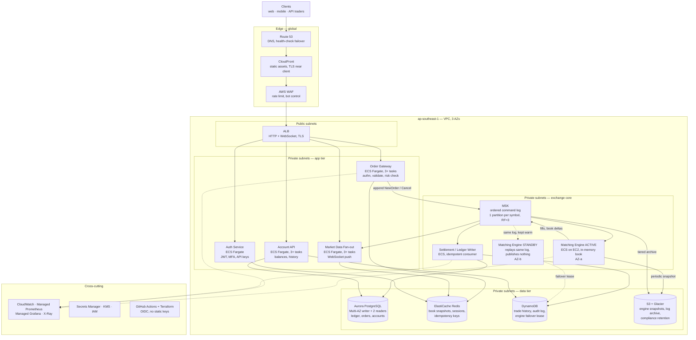

# Problem 1 — Building Castle In The Cloud

## What I'm actually designing

The brief says "similar features to Binance" with 500 rps and a p99 under 100ms. Those two
halves pull in different directions, and it's worth being blunt about it up front:

**500 rps is not a lot of traffic.** A single well-written Go or Java service on one c7g.large
handles that with room to spare. If throughput were the whole problem this would be a boring
design — one ALB, two containers, one Postgres, done.

**The hard part is that it's an exchange.** An exchange has a property most CRUD systems don't:
the order book is a single piece of mutable state that every order must be applied to *in a
defined order*. You cannot shard a single symbol's book across two writers and still be correct —
two matching engines racing on BTC/USDT will produce two different books, and then you owe real
money to people based on a fill that didn't happen. So the interesting architectural work is
not "how do I scale to 500 rps", it's "how do I make a single-writer component highly available
without ever having two writers".

That framing drives everything below. I split the platform into two planes with opposite
properties, and design each on its own terms:

| Plane | Contains | Property | Approach |
|---|---|---|---|
| **Exchange core** | Order entry, sequencer, matching engine, ledger | Ordered, stateful, single-writer, correctness over availability | Event-sourced log + in-memory engine + hot standby |
| **Everything else** | Auth, market data fan-out, account/history reads, notifications | Stateless or read-only, availability over consistency | Horizontally scaled, cached, multi-AZ |

### Features I'm covering, and what I dropped

I picked the features that force me to demonstrate the parts that are actually hard, rather than
the ones that make the diagram look full:

**In scope**

1. **Spot order placement and matching** — limit/market orders, cancel, the order book. This is
   the correctness-critical path and the reason the design looks the way it does.
2. **Real-time market data** — trades, ticker, order book deltas pushed over WebSocket. This is
   the fan-out problem, and it's what actually breaks first as you grow.
3. **Wallet balances and the ledger** — double-entry, because "how much do I have" has to be
   auditable and must never be wrong.
4. **Trade history and audit trail** — the read-heavy, cheap-to-scale tail.

**Explicitly out of scope** (I'd need product input and it wouldn't change the shape of the
infrastructure): futures and margin, lending/staking, fiat on-ramp and payment rails, the KYC
vendor integration, tax-reporting exports, and the internal admin/market-surveillance tooling.
Margin is the one I'd worry about most, because a risk engine that liquidates positions is another
single-writer, latency-sensitive component and it would want the same treatment as the matching
engine.

**Facts I don't have, and what I assumed instead**

| Unknown | I assumed | Why it matters |
|---|---|---|
| Read/write split in the 500 rps | 90% reads (book snapshots, balances, history), 10% order writes → ~50 orders/sec | Sizes the engine and the ledger writes; if it's actually 50/50 the ledger needs partitioning much sooner |
| Is 500 rps average or peak? | Peak sustained; crypto is spiky, so I designed headroom for a 10x burst | Autoscaling reaction time is the thing that kills you in a spike |
| Where the users are | Single region, mostly APAC, so `ap-southeast-1` | A second region changes the HA story completely (see below) |
| Number of symbols at launch | ~50 | Determines whether one engine process is enough (it is) |
| Regulatory jurisdiction | None chosen yet | Drives data residency, retention, and whether the ledger can leave the region at all |
| Is the p99 measured at the edge or at the ALB? | At the edge, client-observed | Costs me ~20-30ms of the 100ms budget before my code runs |

If I got one question answered before starting, it'd be whether 500 rps is the average or the peak.
Everything about autoscaling depends on it.

---

## Overview diagram

### The order lifecycle, in words

1. Trader `POST /api/v3/order` hits CloudFront, WAF checks it, ALB routes to the **Order Gateway**.
2. Gateway authenticates the API key, validates the payload, and does the **pre-trade risk check** —
   does this account actually have the balance to cover this order? It reads the reserved-balance
   projection from Redis (authoritative balance lives in Aurora; Redis holds the hot projection plus
   the idempotency key, so a client retry can't double-submit).
3. Gateway appends a `NewOrder` command to MSK on the partition for that symbol and returns `202`
   with the order id. **This is where the client's latency stops.** Everything after is
   asynchronous, and the fill arrives on the trader's WebSocket.
4. The **matching engine** for that symbol consumes its partition in order, applies the order to the
   in-memory book, and emits `Fill` / `BookDelta` / `OrderRejected` events back onto MSK. All state
   is in memory; the log is the source of truth.
5. **Settlement writer** consumes fills and writes double-entry ledger rows into Aurora, one
   transaction per fill, keyed by the event's sequence number so replay is idempotent.
6. **Market data fan-out** consumes the same events and pushes to subscribed WebSocket clients.
7. **Account API** serves the resulting balances and history from Aurora / DynamoDB / Redis.

Two decisions in there are the ones a reviewer should push on, so let me defend them.

**Why the write path is async (`202`, not `200` with the fill).** Synchronous order placement means
the HTTP request holds a connection open while the order queues at the engine, matches, and lands
in the ledger. Your p99 becomes the sum of every hop's p99 including a Postgres commit, and one
slow disk flush shows up as a client timeout. Async, the client's latency is gateway + one MSK ack —
which I can keep tight and predictable — and the trade result arrives on a channel that was already
open. This is what real exchanges do, and it's why Binance's REST order endpoint returns `NEW`
immediately rather than a fill. The cost is a more complex client. I'd take that trade.

**Why MSK sits in the critical path instead of the engine taking HTTP directly.** The log *is* the
durability and recovery story. Because every state change is an ordered, replayable event, I can
rebuild the exact book on any machine by replaying from the last snapshot — which is what makes the
standby engine possible, and what makes the audit trail free rather than bolted on. Taking HTTP
straight into the engine would be maybe 5ms faster and would leave me with no way to recover an
in-memory book after a crash.

---

## Why each service, and what I considered instead

### Edge

| Service | Role | Why this | Alternatives, and why not |
|---|---|---|---|
| **Route 53** | DNS, health-check-based failover | Health checks integrate with ALB natively, and I need failover records for the DR story | Cloudflare DNS is fine and arguably better at DDoS, but it's another vendor and another auth boundary for no gain at this size |
| **CloudFront** | Static assets, TLS termination near the client, Shield Standard | Terminating TLS at the edge and reusing a warm connection to origin is worth real milliseconds against a 100ms budget. Shield Standard comes free | Serving straight from the ALB costs a full RTT on TLS handshake for distant clients. Fastly/Cloudflare CDN have better cache control, but the AWS-native path keeps WAF, Shield and logging in one place |
| **AWS WAF** | Rate limiting per API key and IP, managed rule sets | Order endpoints are what gets hammered. Rate limiting at the edge means the abuse never reaches my compute | Doing it in the gateway works, but then I'm paying to reject traffic, and a burst can saturate the tasks before autoscaling reacts |
| **ALB** | L7 routing, WebSocket, health checks | Native WebSocket support for long-lived connections, native ECS target registration, multi-AZ by default | **NLB** — lower latency and cheaper for very long-lived WS connections; I'd move market data behind one as it grows. **API Gateway** — nice features, but per-request cost at scale and an extra hop I don't need. **NGINX on EC2** — now I own patching, config, and its own HA |

I'd revisit ALB-vs-NLB for the market data path specifically. ALB gives me path routing and
per-target health, which I want on REST. For 100k mostly-idle WebSocket connections, NLB is cheaper
and lighter. Splitting them is about a day's work, and I'd do it when WS connections cross ~20k.

### Compute

| Service | Role | Why this | Alternatives, and why not |
|---|---|---|---|
| **ECS Fargate** | Gateway, market data, account, auth | No nodes to patch, per-task IAM roles, scales in ~60s. At this size the compute bill is noise, so operational overhead is the scarce resource, not money | **EKS** — better once there are multiple teams needing namespace isolation, autoscaling on custom metrics like consumer lag (KEDA), or a mesh for mTLS. Real value, but weeks of platform work and a permanent operational tax. Not at 500 rps with a small team. **Lambda** — I'd refuse it on the order path: cold starts are fatal to a p99 budget and there's no useful connection reuse to Postgres. Fine for async back-office jobs |
| **ECS on EC2** (matching engine only) | Matching engine active + standby | The engine is the one component where I want the host: pinned CPU, no noisy neighbours, a tuned network stack, and a large in-memory book kept warm. Fargate deliberately hides all of that from me | Fargate for the engine — simpler, and honestly fine at 50 orders/sec. I'm choosing EC2 because the engine's entire job is predictable low-latency behaviour, and Fargate gives me no lever when it isn't behaving |

The EKS question is the one that comes up most, so to be concrete about the trigger: I'd move when
three or more teams deploy independently, or when I need autoscaling on a metric ECS can't express
(consumer lag, usually). Neither is true on day one, and migrating later is bounded work — these
are containers either way.

### The exchange core

| Service | Role | Why this | Alternatives, and why not |
|---|---|---|---|
| **Amazon MSK** | The ordered command log — the system's source of truth | I need strict per-symbol ordering, durable replay from an offset, and several independent consumers reading the same stream. That's exactly Kafka's shape. One partition per symbol gives ordering where I need it and parallelism where I don't | **Kinesis Data Streams** — genuinely close, cheaper to run, and I nearly picked it; it loses on replay ergonomics and consumer-group semantics, and I want the engine's recovery path to be boring. **SQS** — no ordering worth having (FIFO caps out and won't replay). **Self-managed Kafka on EC2** — I don't want to own broker rebalancing during an incident |
| **Matching engine, active/standby** | Applies orders to the in-memory book | Correctness demands exactly one writer per symbol. The standby consumes the identical log and holds an identical book but publishes nothing; on failover it takes over from the last committed offset. Recovery time is bounded by snapshot age, not by log length | **Active/active** — unavailable to me at any price; two writers means two books. **Cold start by full log replay** — works, but recovery grows with the log; snapshot to S3 every N seconds plus a tail replay keeps it to seconds. **A database-backed book** (`SELECT … FOR UPDATE` per order) — the tempting wrong answer: simple, will do 50/sec, and then row locks are your ceiling and your latency is your disk's latency |
| **Settlement / ledger writer** | Fills → double-entry rows in Aurora | Separating settlement from matching means a slow commit can never slow down matching. Idempotent consumer keyed on sequence number, so a crash mid-batch is safe to replay | Writing the ledger inside the engine couples engine latency to Postgres and makes the engine non-deterministic |

### Data

| Service | Role | Why this | Alternatives, and why not |
|---|---|---|---|
| **Aurora PostgreSQL** (Multi-AZ, 2 readers) | Ledger, orders, accounts — anything transactional | Money needs ACID and `NUMERIC`, full stop. Aurora's storage layer replicates six ways across 3 AZs and fails over in ~30s, far better than I'd build myself. Readers absorb account/history load | **RDS PostgreSQL Multi-AZ** — cheaper, but failover is 60-120s and fewer replica options. A legitimate saving if the SLO allows. **DynamoDB for the ledger** — no multi-row transactions worth the name for double-entry; I won't put a ledger on it. **CockroachDB/Yugabyte** — a real multi-region write story I'd want much later, but it's a database my team would be learning during incidents |
| **ElastiCache Redis** (cluster mode, Multi-AZ) | Book snapshots for REST reads, sessions, idempotency keys, rate counters | Sub-ms reads, and it's what keeps the book and balance endpoints inside the latency budget without touching Aurora | **Memcached** — no persistence, no pub/sub, none of the data structures I want. **DAX** — DynamoDB-specific. **In-process cache** — fine for reference data, useless for anything that must be consistent across tasks |
| **DynamoDB** (on-demand) | Trade history, audit log, engine failover lease | Append-heavy, keyed access by `(account, time)`, unbounded growth — its sweet spot, and nothing to operate. The conditional-write lease for engine failover is a bonus I get for free | Keeping history in Aurora — it's the table that grows forever and it'll dominate your backup window and vacuum time. Move it out early |
| **S3 + Glacier** | Engine snapshots, MSK tiered archive, compliance retention | Cheap, durable, the natural home for "keep every order for seven years" | Nothing else is close |

### Cross-cutting

| Service | Role | Notes |
|---|---|---|
| **Terraform** (per-stack state, remote backend with locking) | All infrastructure | Nothing gets clicked in the console. Applies run from CI via OIDC, never from a laptop |
| **GitHub Actions + OIDC** | CI/CD | No long-lived AWS keys anywhere. Pipeline detail is Problem 4 |
| **Secrets Manager + KMS** | DB credentials, API signing keys | Rotated, never in env files, injected as ECS `secrets` |
| **CloudWatch + AMP/AMG + X-Ray** | Metrics, logs, dashboards, tracing | The exchange-specific metrics below matter far more than the generic ones |

---

## Making p99 < 100ms, and how I'd know

### Latency budget for the two paths that matter

Order placement (`POST /order`, client-observed, in-region client):

| Hop | Budget | Notes |
|---|---|---|
| Client → CloudFront (TLS reused) | 15 ms | Dominated by physical distance. A cold handshake adds ~40ms, which is why session resumption at the edge isn't optional |
| CloudFront → ALB | 3 ms | Same region |
| ALB → Gateway task | 2 ms | |
| Gateway: authn + validate + risk check | 8 ms | Two Redis round trips at ~1ms, plus JSON and signature verification |
| Gateway → MSK produce, `acks=all` | 10 ms | Cross-AZ replication to 3 brokers. The single biggest number I control |
| Response back to client | 15 ms | |
| **Total** | **~53 ms** | ~47ms of headroom |

Order book / balance read (`GET`, cache hit):

| Hop | Budget |
|---|---|
| Client → CloudFront → ALB → task | 20 ms |
| Redis read | 2 ms |
| Response | 15 ms |
| **Total** | **~37 ms** |

A cache miss goes to an Aurora reader and adds ~8ms. Still fine.

The honest risks in that budget, ordered by how much they worry me:

1. **`acks=all` to MSK across AZs.** If that 10ms becomes 40ms under load, my headroom is gone.
   I'd load-test it before committing, and run RF=3 with `min.insync.replicas=2` — the standard
   trade, which keeps one broker's slow disk off the critical path.
2. **Fargate autoscaling lag.** Scale-out takes ~60s. A 10x spike inside 10s is served by whatever
   is already running, which is why I'd hold target utilisation at 50-60% rather than the 80% that
   looks efficient on a cost report. Paying for idle capacity *is* the latency SLO.
3. **GC pauses in the engine**, if it's on the JVM. A 200ms stop-the-world pause is an outage in
   this context. That's a language and tuning conversation with the app team rather than an infra
   one, but I want it on the record early.
4. **Anything unbounded.** Every client call gets an explicit timeout, every pool gets a
   connection-acquire timeout, every retry is bounded with jitter. I've been on the wrong end of a
   missing pool timeout — Problem 3 in this repo is exactly that bug, where a transient DB error
   turns into a permanently hung API.

### Verifying rather than asserting

The budget above is arithmetic, and arithmetic isn't evidence. Before I'd claim the SLO:

- Load test at 500 rps sustained, then 5,000 rps for 60s, measuring **client-side** percentiles with
  k6 **from outside AWS**. Measuring inside the VPC hides the edge cost, which is a third of the
  budget.
- Trace the write path end to end with X-Ray, so when the number moves I can see which hop moved.
- Alarm on `order_ack_latency` p99 as an **SLO with a burn rate**, not a static threshold. A p99
  alarm that fires on a 30-second blip trains everyone to ignore alarms.
- The exchange-specific alarms generic monitoring won't give you, which I'd treat as
  non-negotiable:
  - **engine consumer lag** — the engine falling behind the log is the leading indicator of
    everything else;
  - **sequence gap detection** — a missing sequence number means possible data loss, page
    immediately;
  - **crossed book detection** — best bid ≥ best ask means the engine is wrong, and it should halt
    the symbol rather than keep trading;
  - **standby divergence** — standby book hash ≠ active book hash means failover is not safe, and
    I need to know that *before* I need to fail over.

That last group is the difference between monitoring a web app and monitoring an exchange. A
crossed book that keeps trading loses money every millisecond it stays up. Halting a symbol is
embarrassing, and it is unambiguously the right call.

---

## High availability

### What survives what

| Failure | Blast radius | Recovery | Automatic? |
|---|---|---|---|
| One Fargate task dies | None — ALB drains it | Replacement task, ~60s | Yes |
| One AZ lost | ~1/3 capacity; engine fails over if it was there | Standby promotes from last committed offset, seconds | Yes, with the caveat below |
| Aurora writer fails | Writes pause | Failover ~30s | Yes |
| Redis primary fails | Cache misses fall through to Aurora, latency up | Failover ~30s | Yes |
| One MSK broker fails | None, RF=3 / `min.insync.replicas=2` | Broker replaced | Yes |
| Matching engine crashes | That symbol pauses | Standby promotes, or cold start from S3 snapshot + log tail | Yes |
| Bad deploy | Depends | Blue/green with automatic rollback on alarm | Yes |
| Region lost | Full outage | See below | **No, deliberately** |
| Bad code writes bad fills | The worst case in the system | Replay the log into a fixed engine build | No, and it needs a rehearsed runbook |

**Target SLO: 99.95% monthly** (~22 minutes) on the trading path. I'd want to negotiate that against
the business's actual tolerance rather than pick it because it looks good — and I'd want the error
budget agreed before launch, because "99.99%" in a doc with no error budget is a wish, not a target.

The caveat on AZ failover: automatic promotion of the standby is only safe if I can prove the old
active is dead. Two engines publishing fills is far worse than none, because the second one is
*silently* wrong and you find out from customer complaints. So promotion is fenced — the standby
must acquire a lease (DynamoDB conditional write with a TTL) before it publishes anything, and the
active re-checks it still holds the lease before every publish. I'd rather have 30 extra seconds of
downtime than any chance of split brain here.

### On multi-region, and why I'm not doing it

The reflexive answer to "highly available" is active-active across regions. For an exchange ledger
I think that's wrong, and I'd push back:

Cross-region replication is asynchronous. Async replication means RPO > 0. RPO > 0 on a ledger means
that after a failover, some fills exist in customers' trade history and confirmation emails but not
in the surviving ledger. You cannot reconcile that automatically. You are now manually adjudicating
who owns what — a regulatory problem, not an availability one.

So what I'd actually build, in order:

1. **Day one: single region, three AZs.** This covers the realistic failure modes. A whole AWS
   region going away is rare and public, and "we halted trading because our region is down" is a
   survivable news day.
2. **Warm standby in a second region** — same Terraform, MSK replicated with MirrorMaker2, Aurora
   cross-region read replica, scaled near zero. Failover is a deliberate human decision that
   *starts* by halting trading, reconciling the log tail against the ledger, and only then
   reopening. RTO in tens of minutes; RPO effectively zero, because nothing reopens until the books
   balance.
3. **Active-active, but only for the read plane.** Market data and history can absolutely serve from
   multiple regions — market data that's 200ms stale is a UX issue, not a correctness one. This is
   where multi-region actually earns its cost, and it's the piece I'd do first.

Choosing correctness over availability for the ledger and availability over correctness for market
data, inside the same system, is the real design decision here.

---

## Scaling plan

### 500 → 5,000 rps: turn the dials

Almost nothing structural changes. This is the range the design is built for.

- Raise ECS task counts and autoscaling floors; the policies already exist.
- Add Aurora read replicas (up to 15) and route history/balance reads to the reader endpoint. If the
  app isn't already using a separate reader connection string, that's the one code change I'd insist
  on before launch — retrofitting it under load is miserable.
- Enable Redis cluster mode and shard book snapshots by symbol.
- Split market data onto its own NLB and its own task family. It scales with *connected clients*,
  not requests, so sharing an autoscaling policy with the REST tier means one of the two is always
  wrong.
- Move MSK to right-sized brokers with tiered storage.

Cost grows roughly linearly on compute and sublinearly overall, since the fixed costs (MSK, Aurora,
NAT, three-AZ redundancy) are already paid.

### 5,000 → 50,000 rps: the real ceilings

Three things break, in this order:

1. **Market data fan-out.** 50k connected clients all wanting book deltas is a bandwidth-and-CPU
   problem, not a request problem. Fix: a dedicated fan-out fleet, deltas rather than snapshots,
   conflated/throttled updates for retail with an unconflated premium feed, and an edge/POP tier for
   the public feed. I'd expect most engineering time in this transition to go here.
2. **Ledger write throughput.** One Aurora writer will not take 50k writes/sec. Fix: partition the
   ledger by account (hash-based, so it isn't a hot-shard problem), batch fills per account per
   commit instead of one transaction per fill, and age settled history out to DynamoDB/S3 so the hot
   table stays small. If that's not enough, this is where distributed SQL (CockroachDB, Aurora DSQL)
   stops being over-engineering.
3. **Per-symbol engine hot-spotting.** Not the aggregate rate — a single-threaded engine can do far
   more than this; LMAX demonstrated millions of orders/sec on one thread over a decade ago. The
   problem is one symbol going viral and saturating its partition. Fix: symbols are already
   independent, so pin busy symbols to dedicated engine processes on dedicated instances and let the
   long tail share one. This is why one-partition-per-symbol was worth doing on day one even though
   it looks like premature partitioning at 50 orders/sec.

Also in this band, the operational model has to change — multiple teams, independent deploys,
autoscaling on consumer lag. That's the EKS conversation, and by then it's justified.

### Beyond that

Regional read planes as above; colocation and Direct Connect for institutional order flow if
latency-sensitive market makers become customers. At that point the interesting problems have
stopped being about AWS services and started being about network topology and nanoseconds.

---

## Cost

Rough monthly, `ap-southeast-1`, on-demand, for the day-one 500 rps build. These are
order-of-magnitude figures off the pricing pages — I'd rebuild it in the AWS Pricing Calculator with
real task sizes before anyone budgets against it.

| Item | Config | ~USD/month |
|---|---|---|
| Aurora PostgreSQL | 1 writer + 2 readers, `db.r6g.large` | 750 |
| MSK | 3 × `kafka.m5.large`, 3-AZ, 1 TB storage | 600 |
| ECS Fargate | ~14 tasks avg, 1 vCPU / 2 GB | 450 |
| Matching engine | 2 × `c7g.large` (active + standby), reserved | 120 |
| ElastiCache Redis | 3 × `cache.r6g.large`, cluster mode | 400 |
| ALB + NLB | Moderate LCU | 60 |
| NAT gateways | 3 AZs plus data processing | 150 |
| CloudFront + WAF | 1 TB egress, managed rules | 150 |
| DynamoDB | On-demand, modest | 80 |
| S3 + Glacier | Snapshots, archive, logs | 40 |
| Observability | CloudWatch + AMP + AMG | 250 |
| **Total** | | **~3,050** |

Where the money actually goes, and what I'd do about it:

- **The three-AZ tax is most of the bill.** Aurora, MSK, Redis and NAT are all paying for
  redundancy, not throughput. That's the HA requirement and it's the right thing to spend on — but
  it means "cost-effective" here is about not over-provisioning the redundant tier, not about
  shaving compute.
- **Observability at ~8% of infra spend is normal and worth it.** It's also the line that grows
  fastest and most silently; custom metrics and high-cardinality labels are the usual culprit. Worth
  a quarterly review.
- **Cheap wins I'd take immediately:** Graviton everywhere (~20% off compute for a config change),
  Fargate Spot for genuinely stateless async workers — never the gateway or the engine, VPC
  endpoints for S3/DynamoDB/ECR to cut NAT data processing (this one often pays for itself), and
  Savings Plans on the steady-state baseline once there's a month of real usage to size against.
- **Cheap wins I'd refuse:** a single NAT gateway (saves ~$70, reintroduces an AZ dependency),
  Aurora Serverless v2 for the ledger writer (scale-up latency on a cold burst is exactly the wrong
  risk on the write path), and single-AZ anything in the core.

One thing I'd flag to whoever owns the budget: at 500 rps this costs about $3k/month, and it would
cost maybe $600 as a monolith on two EC2 instances with one Postgres. The difference is what it costs
to survive an AZ failure and to have an auditable trail of every order. For an exchange that's an
easy trade — but it should be a decision someone made, not an accident.

---

## What I'd want to fix before calling this done

Being honest about the gaps in my own design:

- **The pre-trade risk check reads from Redis.** If Redis is stale I can accept an order the account
  can't cover. The engine rejects it downstream so no money is lost, but the client gets an async
  rejection after a `202`, which is a poor experience. The proper fix is a reserved-balance model
  where the gateway atomically reserves funds before appending. I know how to build it; it needs the
  app team.
- **I haven't designed the admin/surveillance plane**, and every real exchange needs one — halt a
  symbol, cancel a customer's orders, freeze an account. It touches engine state, so it needs the
  same care as the order path. Bolting it on later is how you end up with an unaudited console that
  can move money.
- **The standby divergence check is a hash comparison I described but didn't specify.** Getting
  book-hash equality right across two independently-replaying processes is fiddlier than one
  sentence makes it sound.
- **DR is only real if it's rehearsed.** An untested runbook is a document, not a capability. I'd
  want a quarterly game day that actually promotes the standby engine and actually fails over the
  region, in a real environment, run by the on-call rotation.

Security is deliberately not covered here beyond the network layout — that's Problem 5, where I go
back through this design and mark up what changes.
