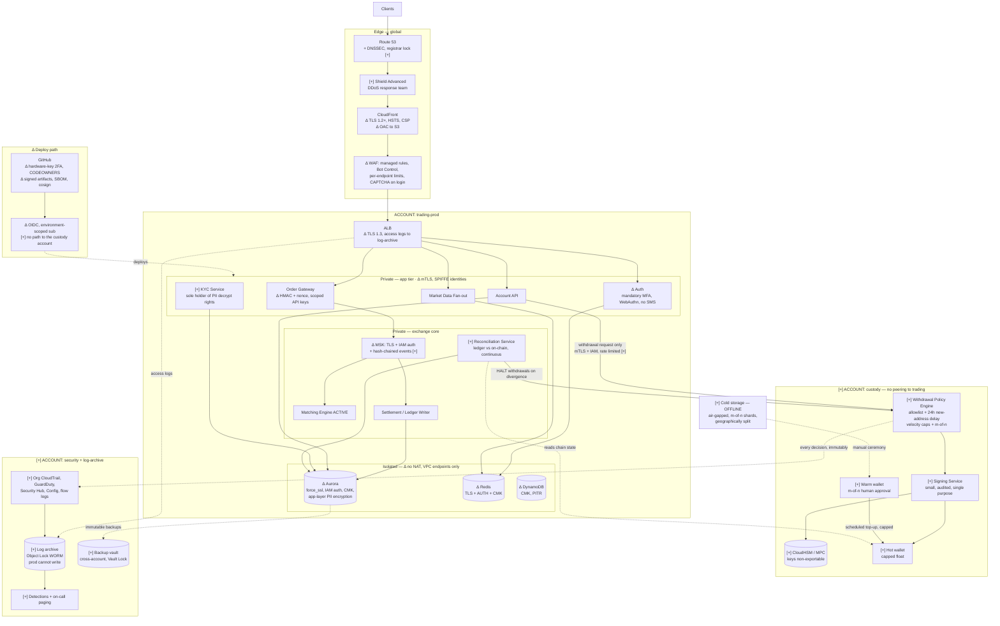

# Problem 5 — Fortify The Castle

> **Which architecture.** The task says "the architecture you designed in Problem 2". Problem 2 in the current
> set is the disk-full scenario, which has no architecture to secure. So I read this as the trading platform
> from **[Problem 1](../problem1/SOLUTION.md)** — the only design in the set. Everything below is a delta
> against that.

## Threat model first, not a checklist

You cannot prioritise security without deciding who you defend against. A checklist gives you a hundred equal
items. A threat model tells you which five matter.

### What is worth stealing

| Asset | Why they want it | Loss |
|---|---|---|
| **Hot wallet signing keys** | Direct, irreversible theft | Existential. No chargeback exists |
| **Withdrawal authorisation path** | Same result without touching a key: make the system sign what you want | Existential |
| **The ledger** | Credit yourself a balance, then withdraw it legitimately | Existential, and harder to detect |
| **KYC data** | Identity fraud, extortion, resale | Regulatory disaster, permanent damage to trust |
| **Customer API keys** | Trade as the user, manipulate thin markets | Serious. User funds move without user action |
| **Order flow, live** | Front-running | Market integrity, regulatory exposure |
| **Availability** | Extortion, or cover for manipulation | An exchange down during volatility loses users permanently |

### Who is coming, ranked by expected loss

1. **Organised crypto-theft groups, including state-sponsored ones.** Crypto exchanges are among the most
   consistently targeted systems on the internet. In the big public thefts the pattern is the same: they rarely
   come through the trading API. They come through **a developer laptop, a compromised dependency, or a
   social-engineered employee**, then walk the deploy path into the signing infrastructure. This shapes the
   whole answer.
2. **Insiders**, malicious or under pressure. Someone with legitimate access to custody is the shortest route
   to the money.
3. **Account takeover operators.** High volume, aimed at users. SIM swap against SMS 2FA is the standard
   technique.
4. **Opportunistic scanners.** Constant and automated. This is what a WAF and patching actually address.
5. **DDoS extortion**, and DDoS as cover for something else.
6. **Market manipulators** using logic, not infrastructure: self-trading, spoofing, thin-book manipulation.

**So the order of this document.** For this system, the highest expected loss comes from **custody design, the
deploy path, and people** — not the web tier. A perfect WAF on a platform whose hot wallet keys sit in
application memory does not help. That is why the architecture changes come first and the perimeter comes
second, which is the opposite of how these documents usually read.

## What I would refuse to ship without

"We will add it in phase two" is how these get lost, so I want to be concrete. I would not put real customer
funds behind this system without all eight:

1. **Hot / warm / cold split**, hot float capped at a defined percentage of assets, and signing keys in
   hardware (CloudHSM or MPC) that the application **cannot extract**. It can only ask for a signature.
2. **Withdrawal policy enforced outside the application:** address allowlist with a delay on new addresses,
   velocity limits, multi-party approval above a threshold. Compromising the API must not be enough to move
   funds.
3. **Continuous ledger-to-chain reconciliation, with automatic withdrawal halt** on divergence. This is the
   control that catches what everything else missed.
4. **Mandatory MFA, and SMS accepted for nothing that matters** — not withdrawal confirmation, not account
   recovery. SIM swap is not theoretical.
5. **Immutable, cross-account backups** of the ledger and the event log. Ransomware deletes backups first. A
   backup the production role can delete is not a backup.
6. **Org-level CloudTrail to an append-only account** that production roles cannot write to. Without a log an
   attacker cannot edit, incident response is guessing.
7. **No standing human access to production**, and no static AWS access keys anywhere.
8. **TLS everywhere including service-to-service**, and encryption at rest with customer-managed KMS keys and
   restrictive key policies.

Everything else on this page is a priority call. Those eight are the floor.

## Updated architecture

`[+]` = added, `[Δ]` = changed from Problem 1, unmarked = unchanged.

The biggest structural change: **custody moves into its own AWS account**, with no network path from the
trading VPC, reachable only through a narrow, authenticated, rate-limited signing API. Second:
**AWS Organizations with hard account boundaries**, so "compromise the app" and "compromise the funds" stop
being the same event.

### The delta at a glance

| Area | Problem 1 had | Now | Threat closed |
|---|---|---|---|
| **Custody** | Not designed | Separate account, HSM, hot/warm/cold, policy engine | Key theft, and API compromise → fund loss |
| **Accounts** | One prod account | Organizations: trading / custody / security / log-archive / staging, with SCPs | Lateral movement, blast radius |
| **Withdrawals** | Implicit in "wallet service" | Policy engine outside the app | Compromised app draining funds |
| **Reconciliation** | Absent | Continuous ledger↔chain with auto-halt | Undetected theft, ledger tampering |
| **Service-to-service** | Plaintext inside the VPC | mTLS, SPIFFE identities | Lateral movement after one RCE |
| **Data-tier egress** | NAT reachable | No NAT, VPC endpoints only | Exfiltration and C2 from a compromised container |
| **PII** | "encrypted at rest" | App-layer encryption, only the KYC service can decrypt | A DB dump stops being an identity-document breach |
| **Auth** | "JWT, MFA" | Mandatory MFA, WebAuthn, no SMS, HMAC-signed API requests with nonce | ATO, SIM swap, replay |
| **Logging** | CloudWatch in-account | Org trail to a WORM archive prod cannot write | An attacker erasing their tracks |
| **Backups** | Aurora automated | Cross-account, Vault Lock immutable | Ransomware, destructive insider |
| **Human access** | Unstated | None standing, JIT via SSM with recording | Standing credentials, unaudited access |
| **Deploy path** | OIDC, pinned actions | Plus artifact signing, CODEOWNERS, hardware keys, and **no route to custody** | Supply chain — how exchanges actually get robbed |

---

## The main changes, and what each stops

### 1. Custody in its own account, keys in hardware `[+]`

**Change.** Signing keys leave the application entirely, into an AWS account with no VPC peering, no transit
gateway attachment, no shared IAM. The platform can call one narrow API — "sign this withdrawal, which
satisfies this policy" — and cannot read, list, or reach a key. Funds split three ways: **hot** with a capped
operational float, **warm** needing m-of-n human approval and topped up on a schedule with per-transfer caps,
and **cold**, air-gapped, shard-split across locations, moved only by a documented ceremony with several
people.

**Stops.** The dominant loss scenario. If keys sit where application code can reach them, any RCE, any leaked
credential, any malicious dependency in the API is a total loss of hot funds. With this split, the same
compromise only gets the ability to *request* signatures that satisfy policy: bounded, rate-limited, logged,
and capped at the hot float.

**Why it is architecture, not a bolt-on.** You cannot add this later without rewriting how the application
moves money. It changes component boundaries, account topology and data flow. This is the change I would fight
hardest for.

**Alternative I would genuinely push for:** delegate custody to a specialist — Fireblocks, Copper, BitGo. For a
startup, self-custody means becoming expert in the hardest security problem in the industry *while also*
building an exchange. Delegating moves that to people who do only that, at the cost of fees, a counterparty,
and less flexibility. **For most teams at this stage I think that is the right call**, and I want the decision
made explicitly rather than by default. I designed for self-custody because it is the harder case.

### 2. Withdrawal policy engine `[+]`

**Change.** A separate service in the custody account decides whether a withdrawal may be signed. Destination
addresses must be allowlisted, with a **24-hour delay before a newly added address can be used**. Per-account
and platform-wide velocity caps. Withdrawals above a threshold need **m-of-n human approval**. The whole thing
can be halted by the reconciliation service.

**Stops.** Everything that ends in "and then they withdrew the funds". A stolen session, a compromised API key,
a leaked internal credential, an insider with app access — none are enough, because the decision happens
somewhere they do not control. The 24-hour address delay specifically defeats the standard ATO flow, because it
gives the user's notification email time to matter.

**Trade-off.** Legitimate large withdrawals get slower and support load goes up. That is a real product cost
and the business may push back. My position: the delay applies to *new addresses*, not all withdrawals, so the
common case stays fast. I would hold that line.

### 3. Continuous reconciliation with automatic halt `[+]`

**Change.** A service continuously sums the internal ledger and compares it to on-chain balances plus known
pending settlements. Beyond a tolerance it **halts withdrawals automatically** and pages.

**Stops.** After custody itself, this is the control I would least want to give up, because it is the only one
that assumes the others failed. Every prevention control can be bypassed by something you did not think of.
Reconciliation does not care *how* the funds left. It notices that they did. At an exchange, the difference
between a bad week and the end of the company is often how many hours passed before anyone noticed.

**Trade-off.** False positives halt withdrawals, which is a visible customer-facing outage, and chain reorgs
and pending-settlement timing make the tolerance genuinely hard to tune. I would still ship it halting
automatically rather than only alerting. A human deciding whether to halt at 4am, under uncertainty, will
hesitate — and hesitation is what the attacker is counting on. Better to explain an unnecessary two-hour pause
than an unnecessary total loss.

### 4. Account isolation and SCPs `[Δ]`

**Change.** AWS Organizations: `trading-prod`, `custody`, `security`, `log-archive`, `staging`,
`shared-services`. SCPs at the OU level that no role in the account can override: deny disabling
CloudTrail/GuardDuty/Config, deny changing Object Lock retention, deny creating IAM users with static keys,
deny leaving the org, restrict regions, and in `custody`, deny everything except the small set it needs.

**Stops.** Blast radius. In a single account, one over-broad IAM policy is one mistake from total. An SCP is the
only AWS control a compromised account administrator cannot turn off, and that property is what makes the
friction worth it.

**Where I accept less:** `staging` gets a much lighter touch, with two hard rules — **no production data,
ever** (not "anonymised", not "a subset"), and **no IAM path to `custody` or `log-archive`**. Staging with a
copy of production KYC data is a breach with a delay on it.

### 5. No egress from the data tier `[Δ]`

**Change.** Data-tier subnets get no NAT gateway. All AWS API access goes through VPC endpoints. App-tier
egress goes through a NAT with a filtered allowlist.

**Stops.** Exfiltration and command-and-control. This is what turns an RCE from a breach into a dead end: code
execution with no outbound path cannot phone home, cannot pull a second stage, cannot stream your database
anywhere. It is cheap, boring, and one of the highest-value controls here. It also cuts the NAT data-processing
bill, which is a rare case of security and cost agreeing.

**Trade-off.** It breaks things in annoying ways — a missing VPC endpoint looks like a mysterious hang. Worth
it, and the fix is always the same once you have seen it twice.

### 6. mTLS between services `[+]`

**Change.** Mutual TLS with SPIFFE-style workload identities over a private CA. "It is inside the VPC" stops
being a trust boundary.

**Stops.** Lateral movement. One compromised container should not be able to impersonate the settlement writer
to the ledger just by being on the same network.

**Honest sequencing:** this is the one item near my non-negotiable list that I would **defer past day one**. It
is real work and it makes debugging harder. The interim position closes most of the same paths: TLS at the ALB,
TLS to every data store, `rds.force_ssl`, and security groups that reference other security groups rather than
CIDR ranges. I would commit to mTLS inside 90 days **in writing**, because "later" with no date means never.

### 7. Authentication and API keys `[Δ]`

Mandatory MFA with TOTP or WebAuthn, and **SMS accepted for nothing that matters**. WebAuthn re-authentication
for withdrawals. A 24-hour withdrawal lock after any password or 2FA change. API keys with explicit scopes
where **withdraw is off by default and needs IP allowlisting to enable**. HMAC-signed requests with timestamp
and nonce, so a captured request cannot be replayed. WAF CAPTCHA on login and registration.

**Stops.** Account takeover — the highest-*frequency* attack, though not the highest impact. SIM swap defeats
SMS 2FA reliably enough that offering it for withdrawal confirmation is negligent, not convenient. The
withdrawal lock after a credential change closes the standard ATO sequence: get in, change the recovery
details, drain.

**Trade-off.** Mandatory MFA costs signups, and the business will have the numbers. I would hold the line for
withdrawal-capable accounts and be flexible on read-only ones.

### 8. Data protection `[Δ]`

Customer-managed KMS keys per data class, not one key for everything, with key policies that deny the
application role `kms:Decrypt` on the KYC key — **only the KYC service can decrypt identity documents**.
Application-layer encryption for PII on top of at-rest encryption, so a database dump or leaked snapshot is not
a disclosure of passports. `rds.force_ssl=1` and IAM database auth, so there is no shared password to leak.
Redis with TLS and AUTH. MSK with TLS and IAM auth. And because the MSK log is the source of truth for the
ledger, its events are **hash-chained**, so tampering after the fact is detectable rather than just unlikely.

Backups go **cross-account with Vault Lock**, and important S3 objects get Object Lock. The reason is specific:
a destructive attacker goes for the backups first, and a backup the production role can delete gives confidence
instead of recovery.

### 9. The deploy path `[Δ]`

Building on [Problem 4](../problem4/SOLUTION.md), because this is how exchanges actually get robbed:

- Hardware-key 2FA enforced org-wide on GitHub. No PATs with write scope. No self-approval.
- Protected branches with CODEOWNERS review on `deploy/`, IAM, and anything custody-adjacent.
- Artifacts signed and **verified at deploy time**. Images signed with cosign and verified at admission. An
  unsigned artifact does not deploy.
- New dependencies need explicit review, not just a passing audit. A malicious package with no known CVE passes
  every scanner.
- **The CI deploy role has no path into the custody account at all.** Custody changes go through a separate
  human-gated pipeline with m-of-n approval. If CI can deploy to custody, then compromising CI is compromising
  custody, and CI is a much softer target.
- Developer endpoints: managed devices, hardware keys, no production access from personal machines. Unglamorous,
  and where the large thefts start.

### 10. Detection and response `[+]`

Prevention fails. What matters then is how fast you know.

Org-wide CloudTrail (including data events on custody S3 and KMS) to the WORM archive, GuardDuty everywhere,
Security Hub, Config conformance packs, VPC flow logs. Necessary, and not interesting.

The interesting detections are exchange-specific, and no off-the-shelf tool ships them:

| Detection | Why |
|---|---|
| Ledger ↔ chain divergence | The backstop for everything else (§3) |
| Withdrawal to a newly allowlisted address above a size threshold | The ATO and insider signature |
| Signing service called outside its normal rate or time profile | Key misuse before the funds are gone |
| Hot wallet dropping faster than the settlement rate explains | Theft in progress |
| Any IAM, KMS key policy or SCP change in the custody account | The precursor to most cloud fund theft |
| CloudTrail delivery stopped, GuardDuty disabled, root console login | Someone covering their tracks |
| One account's order rate or self-match rate spiking | Market manipulation, which is a compliance obligation |

And the part people skip: **a rehearsed incident response plan**. Who can halt trading, who can halt
withdrawals, and how — as a documented, tested, single action, not a scramble. Practised quarterly. An IR plan
never executed is a document, and during an incident the difference between a plan and a document is about four
hours.

---

## Where I decided the risk was acceptable

Unstated accepted risk is just an oversight with better manners, so:

| Accepted | Reasoning | What would change my mind |
|---|---|---|
| **No WAF on internal traffic** | With mTLS and SG-to-SG rules, an L7 firewall between my own services is cost and latency for very little | Multi-tenant workloads, or third-party code in the same VPC |
| **No Shield Advanced on day one** | ~$3k/month is material pre-revenue, and Shield Standard + CloudFront + WAF rate limiting handles ordinary volumetric attacks | Any targeted attack, or the first extortion email. This is an early buy, not a late one — you are paying for the DDoS response team and cost protection, and both matter most during the incident |
| **No public proof-of-reserves at launch** | Internal reconciliation (§3) gives the security benefit. A public attestation is a trust exercise with real engineering cost | Regulatory requirement, or competitors publishing |
| **Field-level encryption only on identity documents and national IDs** | Encrypting everything at app level breaks querying and indexing, and the marginal risk reduction on an email address is small | A specific regulatory requirement |
| **No HSM for TLS private keys** | ACM-managed certs have no exportable private key. A TLS key compromise is bad, but it is not a fund loss | Nothing realistic at this stage |
| **No certificate pinning in the mobile app** | It breaks legitimate proxying and makes cert rotation a release event, for a failure mode (CA compromise) that is rare | High-value institutional mobile users |
| **Staging with much weaker controls** | Speed matters and staging holds nothing worth stealing — **given the two hard rules** in §4 | Any breach of either rule, at which point staging is a production system |
| **Single region** (from Problem 1) | That reasoning was correctness, not security, and it still holds. Multi-region is not a security control | — |
| **No bug bounty at launch** | A bounty without triage capacity produces a queue of unread reports, which is worse than nothing because it looks like a programme | Once there is a security engineer to own triage, which should be soon |

## What I would defer, and in what order

Security work has to be sequenced or it does not happen.

**Before a single real customer deposit — the eight non-negotiables.** Non-negotiable means the platform does
not launch. Realistically that is six to eight weeks, mostly custody. That is the honest answer to "when can we
launch", not a phase-two aspiration.

**First 30 days:** egress lockdown and VPC endpoints (§5, cheap and high value, I would pull it earlier if I
could); app-layer PII encryption for identity documents; the exchange-specific detections wired to real paging,
not a dashboard nobody opens; an external penetration test — **I would not go to public launch without one**, a
design review by the people who built it is not a security assessment; IR runbooks written and walked through
once.

**First 90 days:** mTLS (§6) with the date committed in writing; SCPs tightened from "reasonable" to "minimal",
which needs a month of real access data to do without breaking things; JIT access with an approval workflow
replacing break-glass-only; a quarterly game day that rehearses key compromise and actually halts withdrawals.

**Beyond 90 days:** bug bounty once triage is owned; SOC 2 Type II if enterprise customers need it — worth
noting the controls above cover most of what a SOC 2 audit asks, so doing security properly first makes the
audit an evidence-gathering exercise rather than a remediation project, and doing it the other way round
produces a certificate and not much security; per-feature threat modelling once the team is big enough for that
to be a process; public proof-of-reserves.

**What I would deliberately not do at all:** buy a security product to solve a process problem. The gaps here
are custody design, deploy-path integrity and human process. No tool fixes those, and tool spend is a
comfortable way to feel like they were addressed.

## Facts I do not have

Real blockers, not hedging. Several would change the architecture.

| Unknown | Why it changes the design | How I would get it | Assumed meanwhile |
|---|---|---|---|
| **Self-custody or a third-party custodian?** | The largest fork on this page. A custodian removes the HSM, the signing service and most key-management risk, and replaces it with a counterparty and an API | Product and finance decision, informed by cost and by what the insurer will underwrite | Self-custody, because it is the harder case. **I would push hard for a custodian at this stage** |
| **Jurisdiction and licence** | KYC/AML obligations, data residency, retention, travel-rule reporting | Legal counsel. Must be settled before launch | One jurisdiction with standard VASP-style obligations |
| **Which chains and assets** | Signing complexity varies a lot; UTXO, account-based and smart-contract chains differ in key handling and attack surface | Product roadmap | BTC and one EVM chain |
| **Is there crime / custody insurance?** | Underwriters mandate specific controls, and the premium is a direct read on how good your controls are | Insurance broker. **The underwriter's control questionnaire is one of the most useful security checklists you can get, and it is free** | No insurance, so controls stand alone |
| **Team size, and is there a security engineer?** | Decides what can be operated at all. Controls nobody owns decay into false confidence | Ask | Small team, no security engineer — so I biased toward structural controls over ones needing daily attention |
| **Expected AUM and hot float** | Sets the hot wallet cap, the single number bounding a hot-key compromise | Finance and trading ops | Hot float capped at 2% of assets, refilled twice daily |
| **Existing contractual security commitments** | SOC 2 or ISO 27001 promised to a customer changes the sequencing entirely | Sales and legal | None |
| **Anything already built** | I designed as greenfield. Real systems have a live database with weak controls and no maintenance window, and retrofitting is most of the work | Read the code and the IAM policies, run an assessment | Greenfield |

The two I would chase before writing another line of design: **custody model** and **jurisdiction**. Everything
else can be adjusted later. Those two decide whether this architecture is the right shape at all.

## One thing I would say out loud to leadership

These controls cost real money and real delivery time, and the custody work will look like it is blocking
launch. It is. That is the correct outcome.

An exchange is not a normal web product with money added on. Losses are irreversible, public, and usually fatal
to the business — there is no partial recovery from "the hot wallet is empty". So the security work is not
overhead on the product. For this product it largely *is* the product, and the only version worth launching is
one where somebody has already decided which of those eight things they will not ship without.

I would rather have that argument before launch than write the post-mortem after.
