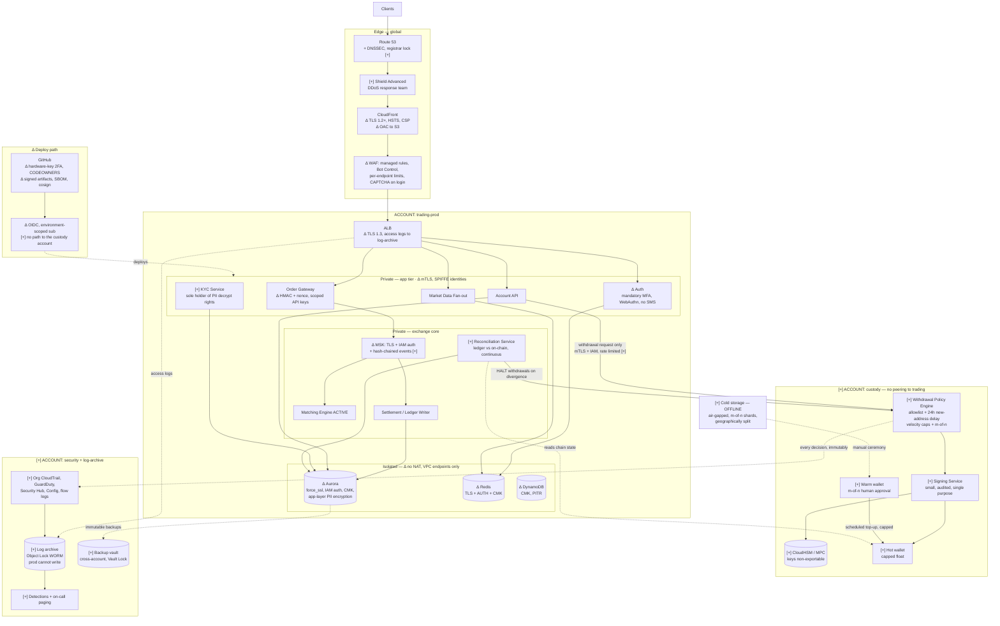

# Problem 5 — Fortify The Castle

> **Which architecture:** the task says "the architecture you designed in Problem 2". Problem 2 in
> the current set is the disk-full troubleshooting scenario, which has no architecture to secure, so
> I've read this as the trading platform from **[Problem 1](../problem1/SOLUTION.md)** — the only
> design in the set. Everything below is a delta against that document.

## Start with the threat model, not the checklist

You cannot prioritise security without deciding who you're defending against. A checklist gives you
a hundred equally-weighted items; a threat model tells you which five matter. So before any control:

### What's actually worth stealing

| Asset | Why an attacker wants it | Loss if compromised |
|---|---|---|
| **Hot wallet signing keys** | Direct, irreversible theft of bearer assets | Existential. Funds are gone; no chargeback exists |
| **Withdrawal authorisation path** | Same outcome without touching a key — just get the system to sign what you want | Existential |
| **The ledger** | Credit yourself a balance, then withdraw it legitimately | Existential, and harder to detect |
| **KYC data** (passports, selfies, addresses) | Identity fraud, extortion, resale | Regulatory catastrophe, permanent reputational damage |
| **Customer API keys** | Trade on behalf of users, manipulate thin markets | Serious; user funds moved without user action |
| **Order flow, in real time** | Front-running | Market-integrity problem, regulatory exposure |
| **Availability** | Extortion, or cover for a market-manipulation window | Revenue and trust; an exchange that's down during volatility loses users permanently |

### Who's coming, ranked by expected loss rather than by frequency

1. **Organised crypto-theft crews, including state-sponsored groups.** Crypto exchanges are among
   the most consistently and competently targeted systems on the internet, and the pattern in the
   large publicised thefts is remarkably consistent: they rarely come through the trading API. They
   come through **a developer's laptop, a compromised dependency, or a social-engineered
   employee**, and then walk the deploy path into the signing infrastructure. This shapes the whole
   answer.
2. **Insiders**, malicious or coerced. Someone with legitimate access to the custody path is the
   shortest route to the funds that exists.
3. **Credential-stuffing and account-takeover operators.** High volume, targeting users rather than
   the platform. SIM-swap against SMS 2FA is the workhorse technique.
4. **Opportunistic scanners.** Constant, automated, and the thing a WAF and patching actually
   address.
5. **DDoS extortion**, and DDoS as cover for something else.
6. **Market manipulators** exploiting logic rather than infrastructure — self-trading, spoofing,
   thin-book manipulation.

**The uncomfortable conclusion**, and the reason this document is ordered the way it is: for this
system, the highest-expected-loss attack paths are **custody design, the deploy path, and human
process** — not the web tier. A perfect WAF configuration on a platform whose hot wallet keys live
in application memory is a rounding error. So the architectural changes come first and the perimeter
work comes second, which is the opposite of the order these documents usually take.

---

## What I would refuse to ship without

Being concrete about non-negotiables, because "we'll add it in phase two" is how these get lost.
I would not put real customer funds behind this system without every one of these:

1. **Hot / warm / cold custody split**, hot float capped at a defined percentage of assets, and
   signing keys in hardware (CloudHSM or MPC) that the application **cannot extract** — it can only
   ask for a signature.
2. **Withdrawal policy enforced outside the application**: address allowlist with a delay on new
   addresses, velocity limits, and multi-party approval above a threshold. Compromising the API must
   not be sufficient to move funds.
3. **Continuous ledger-to-chain reconciliation with an automatic withdrawal halt** on divergence.
   This is the control that catches the compromise every other control missed.
4. **Mandatory MFA, and SMS accepted for nothing that matters** — not withdrawal confirmation, not
   account recovery. SIM swap is not theoretical.
5. **Immutable, cross-account backups** of the ledger and the event log. Ransomware deletes backups
   first; a backup the production role can delete is not a backup.
6. **Organisation-level CloudTrail to an append-only account** that production roles cannot write
   to. Without a log an attacker can't edit, incident response is guesswork.
7. **No standing human access to production**, and no static AWS access keys anywhere.
8. **TLS everywhere including service-to-service**, and encryption at rest under customer-managed
   KMS keys with restrictive key policies.

Everything else on this page is a priority call. Those eight are the floor.

---

## Updated architecture

Marked as: **`[+]`** added, **`[Δ]`** changed from Problem 1, unmarked means unchanged.

The single biggest structural change: **custody moves into its own AWS account** with no network
path from the trading VPC, reachable only through a narrow, authenticated, rate-limited signing API.
The second: **AWS Organizations with hard account boundaries**, so "compromise the app" and
"compromise the funds" stop being the same event.

### The delta at a glance

| Area | Problem 1 had | Now | Threat closed |
|---|---|---|---|
| **Custody** | Not designed | Separate account, HSM, hot/warm/cold, policy engine | Key theft, and API compromise → fund loss |
| **Accounts** | One prod account | Organizations: trading / custody / security / log-archive / staging, with SCPs | Lateral movement; blast radius |
| **Withdrawals** | Implicit in "wallet service" | Policy engine outside the app: allowlist, delay, velocity, m-of-n | Compromised app draining funds |
| **Reconciliation** | Absent | Continuous ledger↔chain with auto-halt | Undetected theft; ledger tampering |
| **Service-to-service** | Plaintext inside the VPC | mTLS, SPIFFE identities | Lateral movement after one RCE |
| **Data-tier egress** | NAT reachable | No NAT; VPC endpoints only | Exfiltration and C2 from a compromised container |
| **PII** | "encrypted at rest" | Application-layer encryption; only the KYC service can decrypt | A DB dump stops being a breach of identity documents |
| **Auth** | "JWT, MFA" | Mandatory MFA, WebAuthn, no SMS factor, HMAC-signed API requests with nonce | ATO, SIM swap, replay |
| **Logging** | CloudWatch in-account | Org trail to a WORM archive prod can't write to | An attacker erasing their tracks |
| **Backups** | Aurora automated | Cross-account, Vault Lock immutable | Ransomware, destructive insider |
| **Human access** | Unstated | None standing; JIT via SSM with recording | Standing credentials; unaudited access |
| **Deploy path** | OIDC, pinned actions | Plus artifact signing, CODEOWNERS, hardware keys, and **no route to custody** | Supply chain — the way exchanges actually get robbed |

---

## Change by change: what it is, what it stops

### 1. Custody as a separate account with hardware-backed keys `[+]`

**The change.** Signing keys move out of the application entirely, into a dedicated AWS account with
no VPC peering, no transit gateway attachment, and no shared IAM. The trading platform can call one
narrow API — "sign this withdrawal, which satisfies this policy" — and cannot read a key, list keys,
or reach the HSM directly. Funds are split three ways: a **hot** wallet with a capped operational
float, a **warm** wallet requiring m-of-n human approval, topped up on a schedule with per-transfer
caps, and **cold** storage that is air-gapped, shard-split across geographies, and moved only via a
documented ceremony with multiple people.

**What it protects against.** The dominant loss scenario. If keys live where application code can
reach them, then any RCE, any leaked credential, any malicious dependency in the API is a total loss
of hot funds. With this split, the same compromise gets an attacker the ability to *request*
signatures that satisfy policy — bounded, rate-limited, logged, and capped at the hot float.

**Why it's architecture and not a bolt-on.** You cannot add this later without rewriting how the
application moves money. It changes the component boundaries, the account topology, and the data
flow. This is the single change I would fight hardest for.

**Alternative I'd genuinely push for:** delegate custody to a specialist — Fireblocks, Copper, BitGo.
For a startup, self-custody means becoming an expert in the hardest security problem in the industry
while also building an exchange. Delegating moves the hardest part to people who do only that, at the
cost of fees, a counterparty dependency, and less flexibility. **For most teams at this stage I think
that's the right call**, and I'd want the decision made explicitly rather than by default. The
architecture above assumes self-custody because it's the harder case to design.

### 2. The withdrawal policy engine `[+]`

**The change.** A separate service, in the custody account, that decides whether a withdrawal may be
signed. Rules: destination addresses must be allowlisted, with a **24-hour delay before a newly-added
address can be used**; per-account and platform-wide velocity caps; withdrawals above a threshold
require **m-of-n human approval**; and the whole thing can be halted by the reconciliation service.

**What it protects against.** Everything that ends in "and then they withdrew the funds." A stolen
session, a compromised API key, a leaked internal credential, a malicious insider with app access —
none of them are sufficient, because the authorisation decision happens somewhere they don't control.
The 24-hour address delay specifically defeats the standard ATO flow, because it gives the user's
notification email time to matter.

**Trade-off, stated plainly.** This makes legitimate large withdrawals slower and generates support
load. That's a real product cost and the business may push back. My position: the delay applies to
*new addresses*, not all withdrawals, which keeps the common case fast, and I'd hold the line on it.

### 3. Continuous reconciliation with automatic halt `[+]`

**The change.** A service that continuously sums the internal ledger and compares it to observed
on-chain balances plus known pending settlements. On divergence beyond a tolerance, it **halts
withdrawals automatically** and pages.

**What it protects against.** This is the control I'd be least willing to give up after custody
itself, because it's the only one that assumes the others failed. Every prevention control can be
bypassed by something you didn't think of. Reconciliation doesn't care *how* funds left — it notices
that they did. Historically, the difference between a bad week and an extinction event at an exchange
has often been how many hours passed before anyone noticed.

**Trade-off.** False positives halt withdrawals, which is a visible customer-facing outage, and chain
reorgs and pending-settlement timing make the tolerance genuinely tricky to tune. I'd still ship it
halting automatically rather than merely alerting. A human deciding whether to halt at 4am, under
uncertainty, will hesitate — and hesitation is exactly what the attacker is counting on. Better to
explain an unnecessary two-hour withdrawal pause than an unnecessary total loss.

### 4. Account isolation and SCPs `[Δ]`

**The change.** AWS Organizations. `trading-prod`, `custody`, `security`, `log-archive`, `staging`,
`shared-services`. Service Control Policies at the OU level that no role in the account can override:
deny disabling CloudTrail/GuardDuty/Config, deny deleting or altering Object Lock retention, deny
creating IAM users with static keys, deny leaving the organisation, restrict regions, and in
`custody`, deny everything except the small set of actions that account needs.

**What it protects against.** Blast radius. In a single-account design, an over-broad IAM policy is
one mistake away from being total. An SCP is the only control in AWS that a compromised
account-administrator cannot turn off — that property is what makes it worth the operational
friction.

**Where I'd accept less:** `staging` gets a much lighter touch, with two hard rules — **no production
data, ever** (not "anonymised", not "a subset"), and **no IAM path to `custody` or `log-archive`**.
Staging with a copy of production KYC data is a breach with a delay on it.

### 5. Killing egress from the data tier `[Δ]`

**The change.** Data-tier subnets get no NAT gateway. All AWS API access goes through VPC endpoints
(S3, DynamoDB, KMS, Secrets Manager, SSM, ECR, CloudWatch Logs). App-tier egress goes through a NAT
with a filtered allowlist of destinations.

**What it protects against.** Exfiltration and command-and-control. This is the control that turns an
RCE from a breach into a dead end: code execution with no outbound path can't phone home, can't pull
a second stage, and can't stream your database anywhere. It's cheap, it's boring, and it's one of the
highest-value controls on this page. It also happens to reduce the NAT data-processing bill, which is
a rare case of security and cost pointing the same way.

**Trade-off.** It breaks things in ways that are annoying to debug — a missing VPC endpoint presents
as a mysterious hang. Worth it, and the fix is always the same once you've seen it twice.

### 6. mTLS between services `[+]`

**The change.** Mutual TLS with SPIFFE-style workload identities via App Mesh or a service mesh, over
a private CA. "It's inside the VPC" stops being a trust boundary.

**What it protects against.** Lateral movement. One compromised container should not be able to
impersonate the settlement writer to the ledger, or read the market data stream, purely by being on
the same network.

**Honest sequencing:** this is the one item on my non-negotiable-adjacent list that I'd **defer past
day one**. It's real work, it makes debugging harder, and the interim position — TLS at the ALB, TLS
to every data store, `rds.force_ssl`, and security groups that reference security groups rather than
CIDR ranges so only the specific caller can connect — closes most of the same paths. I'd commit to
mTLS inside 90 days and say so in writing, because "we'll do it later" without a date means never.

### 7. Authentication and API keys `[Δ]`

**The changes:** mandatory MFA with TOTP or WebAuthn and **SMS accepted as a factor for nothing that
matters**; WebAuthn re-authentication for withdrawals; a 24-hour withdrawal lock after any password
or 2FA change; API keys with explicit scopes where **withdraw is off by default and requires IP
allowlisting to enable**; HMAC-signed requests with a timestamp and nonce so a captured request can't
be replayed; and WAF CAPTCHA on login and registration.

**What it protects against.** Account takeover, which is the highest-*frequency* attack even though
it's not the highest-impact. SIM swap defeats SMS 2FA reliably enough that offering it for withdrawal
confirmation is negligent rather than convenient. The withdrawal lock after a credential change
closes the standard ATO sequence: get in, change the recovery details, drain.

**Trade-off.** Mandatory MFA costs signups, and the business will have data showing exactly how many.
I'd hold the line for withdrawal-capable accounts and be flexible about read-only ones.

### 8. Data protection `[Δ]`

Customer-managed KMS keys per data class, not one key for everything, with key policies that deny the
application role `kms:Decrypt` on the KYC key — **only the KYC service can decrypt identity
documents**. Application-layer encryption for PII on top of at-rest encryption, so a database dump or
a leaked snapshot is not a disclosure of passports. `rds.force_ssl=1` and IAM database auth so there
is no shared password to leak. Redis with TLS and AUTH. MSK with TLS and IAM auth. And because the
MSK log is the source of truth for the ledger, its events are **hash-chained** so retroactive
tampering is detectable rather than merely unlikely.

Backups go **cross-account with Vault Lock**, and S3 objects that matter get Object Lock. The reason
is specific: a destructive attacker's first move is the backups, and a backup that the production
role can delete provides confidence rather than recovery.

### 9. The deploy path `[Δ]`

Building on [Problem 4](../problem4/SOLUTION.md), because this is the attack path that actually gets
exchanges robbed:

- Hardware-key 2FA enforced org-wide on GitHub. No PATs with write scope. No self-approval.
- Protected branches with CODEOWNERS review required on `deploy/`, IAM, and anything custody-adjacent.
- Artifacts signed and **verified at deploy time**, images signed with cosign and verified at
  admission. An unsigned artifact does not deploy.
- New dependencies require explicit review, not just a passing audit. A malicious package with no
  known CVE passes every scanner.
- **The CI deploy role has no path into the custody account, at all.** Custody changes go through a
  separate, human-gated pipeline with m-of-n approval. If CI can deploy to custody, then compromising
  CI is compromising custody, and CI is a much softer target.
- Developer endpoints: managed devices, hardware keys, no production access from personal machines.
  This is unglamorous and it is where the large thefts start.

### 10. Detection and response `[+]`

Prevention fails. What matters then is how fast you know.

Org-wide CloudTrail (including data events on custody S3 and KMS) to the WORM log archive, GuardDuty
on every account, Security Hub, Config with conformance packs, VPC flow logs. Generic, necessary, not
interesting.

The interesting detections are the exchange-specific ones, which no off-the-shelf tool ships:

| Detection | Why it matters |
|---|---|
| Ledger ↔ chain divergence | The backstop for everything else (§3) |
| Withdrawal to a newly-allowlisted address above a size threshold | The ATO and insider signature |
| Signing service invoked outside its normal rate or time profile | Key misuse before the funds are gone |
| Hot wallet balance dropping faster than the settlement rate explains | Theft in progress |
| Any IAM, KMS key policy, or SCP change in the custody account | The precursor step to most cloud fund theft |
| CloudTrail delivery stopped, GuardDuty disabled, root console login | Someone covering their tracks |
| A single account's order rate or self-match rate spiking | Market manipulation, which is a compliance obligation |

And the part people skip: **a rehearsed incident response plan**. Who can halt trading, who can halt
withdrawals, and how — as a documented, tested, single action, not a scramble. Practised quarterly.
An IR plan that has never been executed is a document, and during an incident the difference between
a plan and a document is about four hours.

---

## Where I decided the risk was acceptable

The task asks where I'd leave things as they stand. Being explicit, because unstated accepted risk is
just an oversight with better manners.

| Accepted | Reasoning | What would change my mind |
|---|---|---|
| **No WAF on internal service traffic** | With mTLS and SG-to-SG rules, an L7 firewall between my own services is cost and latency for very little. Defence in depth has diminishing returns and a real operational price | Multi-tenant workloads, or third-party code running in the same VPC |
| **No Shield Advanced on day one** (`[+]` in the diagram, but phased) | ~$3k/month is material pre-revenue, and Shield Standard plus CloudFront plus WAF rate limiting handles ordinary volumetric attacks | Any targeted attack, or the first extortion email. This is an early buy, not a late one — the DDoS response team and cost protection are what you're paying for, and both matter most during the incident |
| **No public proof-of-reserves at launch** | Internal reconciliation (§3) gives the security benefit. A public attestation is a trust and marketing exercise with real engineering cost | Regulatory requirement, or competitors publishing |
| **No field-level encryption on all PII, only on identity documents and national IDs** | Encrypting everything at the application layer breaks querying and indexing, and the marginal risk reduction on an email address is small | A specific regulatory requirement, or a data-residency obligation |
| **No HSM for TLS private keys** | ACM-managed certificates with no exportable private key are already strong. A TLS key compromise is bad; it is not a fund loss | Nothing realistic at this stage |
| **No certificate pinning in the mobile app** | It breaks legitimate proxying and makes cert rotation a release event. The failure mode it prevents (a CA compromise) is rare relative to the operational cost | High-value institutional mobile users |
| **Staging with materially weaker controls** | Speed matters and staging holds nothing worth stealing — **given the two hard rules**: no production data, no IAM path to custody or log-archive | Any breach of either rule, at which point staging is a production system |
| **Single region** (carried over from Problem 1) | The reasoning there was correctness, not security, and it holds. Multi-region is not a security control | — |
| **No bug bounty at launch** | A bounty without triage capacity produces a queue of unread reports, which is worse than nothing because it looks like a programme. Start with a published disclosure policy and an inbox someone owns | Once there's a security engineer to own triage — which should be soon |

---

## What I'd defer, and in what order

Security work has to be sequenced or it doesn't happen. This is what I'd actually do, in this order.

**Before a single real customer deposit — the eight non-negotiables above.** Non-negotiable means the
platform doesn't launch. In practice that's roughly six to eight weeks of work, dominated by custody,
and it's the honest answer to "when can we launch" rather than a phase-two aspiration.

**First 30 days after launch**
- Egress lockdown and VPC endpoints (§5) — cheap and high value, and I'd pull it earlier if I could.
- Application-layer PII encryption for identity documents.
- The exchange-specific detections wired to actual paging, not a dashboard nobody opens.
- An external penetration test. **I would not go to public launch without one** — a design review by
  the people who built it is not a security assessment.
- Incident response runbooks written and walked through once.

**First 90 days**
- mTLS between services (§6), with the date committed in writing.
- SCPs tightened from "reasonable" to "minimal", which needs a month of real access data to do
  without breaking things.
- JIT access with approval workflow replacing the initial break-glass-only model.
- Quarterly game day: rehearse a key-compromise scenario, actually halt withdrawals in a real
  environment.

**Beyond 90 days**
- Bug bounty, once triage is owned.
- SOC 2 Type II, if enterprise or institutional customers need it. Worth noting: the controls above
  cover most of what a SOC 2 audit asks for, and doing security properly first makes the audit an
  evidence-gathering exercise rather than a remediation project. Doing it the other way round produces
  a certificate and not much security.
- Formal threat modelling per feature, once the team is big enough for that to be a process rather
  than a meeting.
- Public proof-of-reserves attestation.

**What I'd deliberately not do at all:** buy a security product to solve a process problem. The gaps
in this design are custody design, deploy-path integrity and human process. No tool fixes those, and
tool spend is a comfortable way to feel like they've been addressed.

---

## Facts I don't have

The task asks me to say what I'd need, how I'd get it, and what I assumed meanwhile. These are
genuine blockers, not hedging — several would change the architecture.

| Unknown | Why it changes the design | How I'd get it | Assumed meanwhile |
|---|---|---|---|
| **Self-custody or a third-party custodian?** | The largest single architectural fork on this page. A custodian removes the HSM, the signing service and most of the key-management risk, and replaces it with a counterparty and an API | Product and finance decision, informed by cost and by what the insurer will underwrite | Self-custody, because it's the harder case. **I'd push hard for a custodian at this stage** |
| **Jurisdiction and licence** | Drives KYC/AML obligations, data residency, retention periods, whether the ledger may leave the region, and travel-rule reporting | Legal counsel. Needs to be settled before launch, not after | A single jurisdiction with standard VASP-style obligations |
| **Which chains and assets** | Signing complexity varies enormously; UTXO, account-based and smart-contract chains have different key handling and different attack surfaces | Product roadmap | BTC and an EVM chain — one of each model |
| **Is there crime / custody insurance?** | Underwriters mandate specific controls, and the premium is a direct read on how good your controls are | Insurance broker. **The underwriter's control questionnaire is one of the most useful security checklists you can get, and it's free** | No insurance, so controls stand alone |
| **Team size, and is there a security engineer?** | Determines what can be operated at all. Controls nobody owns decay into false confidence | Ask | Small team, no dedicated security engineer — so I biased toward controls that are structural rather than ones needing daily attention |
| **Expected AUM and hot-float requirement** | Sets the hot wallet cap, which is the single number that bounds a hot-key compromise | Finance and trading ops | Hot float capped at 2% of assets, refilled twice daily |
| **Existing contractual security commitments** | SOC 2 or ISO 27001 promised to a customer changes the sequencing entirely | Sales and legal | None |
| **Anything already built** | I've designed as if greenfield. Real systems have a live database with weak controls and no maintenance window, and retrofitting is most of the work | Read the code, read the IAM policies, run an assessment | Greenfield |

The two I'd chase before writing another line of design: **custody model** and **jurisdiction**.
Everything else can be adjusted later; those two determine whether this architecture is the right
shape at all.

---

## One thing I'd say out loud to leadership

The controls on this page cost real money and real delivery time, and the custody work in particular
will look like it's blocking launch. It is. That's the correct outcome.

An exchange is not a normal web product with money bolted on. Losses are irreversible, they're
public, and they're usually fatal to the business — there is no partial recovery from "the hot wallet
is empty". The failure mode isn't a bad quarter, it's the end of the company. Which means the
security work isn't overhead on the product; for this product, it substantially *is* the product, and
the only version of this system worth launching is one where somebody has already decided which of
these eight things they will not ship without.

I'd rather have that argument before launch than write the post-mortem after.
